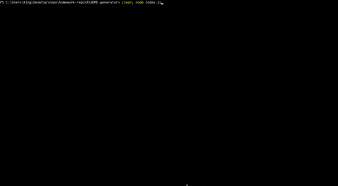

  # README-generator

  

  ## Table of Contents

    * [Description](#description) 

    * [Installation](#installation) 

    * [Usage](#usage) 

    * [Contributing](#contributing) 

    * [Test](#test) 

    * [Credits](#credits) 

    * [License](#license) 

    * [Questions](#questions) 

  ## Description:
  

    The app prompts the user with a series of questions relating to their project. All answers given to the inquirer prompt will be used to build a README.md file for the user.
  ## Installation: 
    To install, clone or fork the repository. When you have completed the cloning/forking, make sure to install the dependencies required to run the program with 'npm i' commands.
  ## Usage:
    To use, make sure you have the npm dependencies installed. Open your preferred terminal with the correct path to the directory of this project and run the cmd line 'node index.js'. Answer all questions that is prompted by the app and the README.md file will be created.
  ## Contributing: 
    No contributors
  ## Test: 
    N/A
  ## License:  

  This project is protected under the [MIT](https://opensource.org/licenses/MIT) license. Use is encouraged as outlined in this license.

  ## Questions: 
  For questions about the project go to my GitHub page at:

    * [GitHub Profile](https://github.com/Nardacyon)
